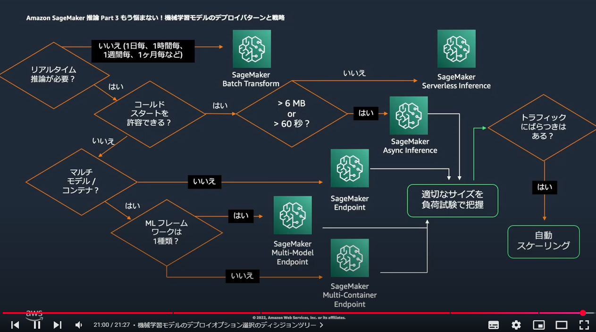

## 問題 2

アップロードした画像に基づいてテキストを説明を生成する ML モデルを使用します。

画像の合計サイズは最大 50MB です。

最小限の運用オーバーヘッドでこの要件を満たすソリューションを選択します。

## 解答

Amazon SageMaker 非同期推論（Asynchronous inference）エンドポイントとスケーリングポリシーを作成します。
各画像に対して推論リクエストを送信するスクリプトを実行します。

## 解説

Amazon SageMaker 非同期推論（Asynchronous inference）

「Amazon SageMaker 非同期推論（Asynchronous inference）エンドポイント」と「スケーリングポリシー」を使用することで需要の変動に対応した「スケーラブル」な推論処理が実現でき、最小限の運用オーバーヘッドで運用可能なため正解です。

Amazon SageMaker 非同期推論（Asynchronous inference）は、リクエストの待ち時間を最小化しつつ、大規模な需要にスケーラブルに対応するために最適化されています。
この機能により、推論リクエストが処理されるまでの間、リクエストを「非同期キュー」に保存し、完了後に結果を S3 バケットに保存することで、処理が完了するのを待つ必要がありません。
さらに、スケーリングポリシーを設定することで、リソースの使用状況に応じた「Auto Scaling」が可能になり、需要の変動に迅速に対応できます。
このソリューションは最小限の運用オーバーヘッドで管理可能であり、完全マネージド型のサービスとして効率的な運用を実現します。

## 非同期推論（Asynchronous inference）

Amazon SageMaker 非同期推論は、受信リクエストをキューに入れ、非同期的に処理 SageMaker するの機能です。このオプションは、ペイロードサイズが大きく（最大 1GB）、処理時間が長い（最大 1 時間）、ほぼリアルタイムのレイテンシー要件があるリクエストに最適です。
非同期推論では、処理するリクエストがない場合、インスタンスカウントをゼロに Auto Scaling することによりコストを節約できるため、エンドポイントがリクエストを処理している場合にのみ料金が発生します。

## 何をどこで使用するのか？

